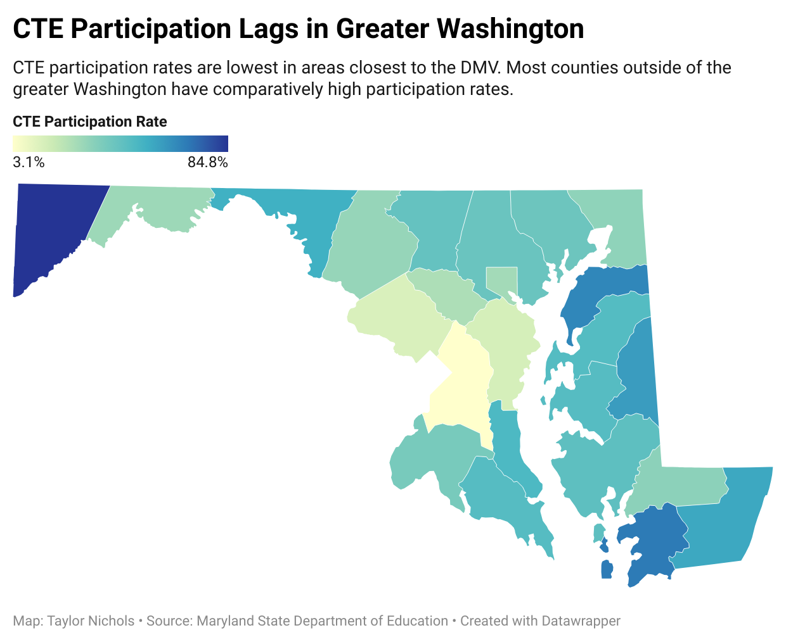

```{r}
library(tidyverse)
library(tidycensus)
library(janitor)
library(tesseract)
library(magick)
library(tidycensus)
```

1. Loading and cleaning
```{r}
#load my education data
md_ed_counties <- read_csv("choose_md_compare_counties.csv")
```

```{r}
#load racial demographics
acs5_variables <- load_variables(2021, "acs5", cache = TRUE)
md_racial_demographics <- get_acs(geography = "county",
              variables = c(total_race = "B02001_001", white = "B02001_002", black = "B02001_003", american_indian = "B02001_004", asian = "B02001_005", native_hawaiian_pi = "B02001_006", latino = "B03002_012", med_income = "B19013_001"),
              state = "MD",
              year = 2021)
```

```{r}
#clean racial demographics to make it easier to read/joinable

#chatgpt helped me do this
md_racial_demographics_wide <- md_racial_demographics |> 
  pivot_wider(names_from = variable, values_from = estimate)
```


```{r}
md_racial_demographics_grouped <- md_racial_demographics_wide |>
  select(-moe) |>
  group_by(NAME, GEOID)

#chatgpt helped me here as well - took a few tries to get the data to show up correctly. 
md_demographics_consolidated <- md_racial_demographics_grouped |>
  mutate(across(everything(), ~ if (is.numeric(.)) sum(., na.rm = TRUE) else first(.))) |>
  slice(1)  # Keep only one row per county
#why am i getting an x but it's still running?
```

```{r}
md_demographics_consolidated <- md_demographics_consolidated |>
  rename(County = NAME) |>
  mutate(County = str_to_title(str_remove_all(County,", Maryland"))) |>
  mutate(County = str_trim(County,side="both"))
```


```{r}
#now let's join!
education_and_racial_demographics <- md_ed_counties |> inner_join(md_demographics_consolidated, join_by(County))
```


```{r}
#now I need to clean and join my CTE and graduation rates data
grad_rates_cte <- read_csv("md_hs_grad_rates_cte.csv")

ed_data_demographics_total <- education_and_racial_demographics |> inner_join(grad_rates_cte, join_by(County))

ed_data_demographics_total <- ed_data_demographics_total |>
  clean_names()

ed_data_demographics_total <- ed_data_demographics_total |>
   rename(pub_expenditure = public_school_expenditures_per_pupil_dollars, 
         number_hs_grads = annual_number_of_public_high_school_graduates, 
         cte_participation_pct = x2022_45_percent_goal_attainment_cte_participation) |>
  mutate(pct_white = white/total_race*100, 
         pct_black = black/total_race*100, 
         pct_latino = latino/total_race*100, 
         pct_asian = asian/total_race*100) |>
  mutate(cte_participation_pct = str_remove_all(cte_participation_pct, "%"))
```
1. Profile of my data
I chose an unfortunately complicated dataset. My original dataset is provided by the Maryland Department of Commerce. It includes a hodgepodge of different data pieces from different years compiled by the dept of commerce. The original source of these data points come from the Maryland State Department of Education, the Maryland Higher Education Commission and the Census. Data years are the 2017-18, 2018, 2019, and then the census data spans 2014-2018. All in all, a bit chaotic. Also unclear what the dept. of commerce is using this data for.

I added census data on racial demographics and median income from 2021. I also added graduation rates for 2021, college enrollment rates for the classes of 2019 and 2021, and CTE participation rates by count for the class of 2022 from the Maryland State Dept of Education. Mine is all aggregate data, but I don't have access to the original data to check it.

2. Data Exploration

Generating summary data from itemized data using group_by and summarize.
Cleaning up data as necessary.
Describing in text the results of your work, your questions and potential story ideas.
Visualizing data through at least two (2) charts and maps.

First, I want to look at the relationship between expenditure per pupil and other factors. Let's start by looking at which counties spend the most on their students compared to median income.
```{r}
ggplot(ed_data_demographics_total, aes(x=pub_expenditure, y=med_income)) + 
  geom_point()
```
Looks like there isn't a strong relationship between a county's median income and how much schools spend on students. Next, let's look at how expenditure per pupil relates to high school graduation rates.

```{r}
ggplot(ed_data_demographics_total, aes(x=pub_expenditure, y=hs_grad_rate_pct_21)) + 
  geom_point()
```
This is interesting. It looks like school districts that spend the least on their students have high graduation rates. The lower grad rates come from districts that spend a medium to high amount on their students. Let's see how median income impacts graduation rates.

```{r}
ggplot(ed_data_demographics_total, aes(x=med_income, y=hs_grad_rate_pct_21)) + 
  geom_point()
```
Looks like most of the lower graduation rates come from areas with lower median income. I wonder what the relationship between high school graduation rates and student:teacher ratio looks like.

```{r}
ggplot(ed_data_demographics_total, aes(x=public_school_student_teacher_ratio, y=hs_grad_rate_pct_21)) + 
  geom_point()
```

Also not really what I expected. Looks like schools that have low graduation rates mostly come from areas with low student:teacher ratios. The student:teacher ratio data is from Oct. 2018 and the graduation rate for 2021 would be the kids in that freshman class in 2018.

What I want to know is what schools with low graduation rates have in common. Let's check racial demographics and CTE participation.

```{r}
ggplot(ed_data_demographics_total, aes(x=cte_participation_pct, y=hs_grad_rate_pct_21)) + 
  geom_point()
```

The trend I'm seeing so far is that counties with low graduation rates tend to have low to middle CTE participation, low to mid student:teacher ratios, low to middle median incomes, and mid to high expenditure per pupil. Seems like these counties are trying to better support their students but it doesn't seem to be helping grad rates (although I'd want to look at that over time obviously.)

Let's look at racial demographics.

```{r}
ggplot(ed_data_demographics_total, aes(x=pct_white, y=hs_grad_rate_pct_21)) + 
  geom_point()

ggplot(ed_data_demographics_total, aes(x=pct_black, y=hs_grad_rate_pct_21)) + 
  geom_point()

ggplot(ed_data_demographics_total, aes(x=pct_latino, y=hs_grad_rate_pct_21)) + 
  geom_point()

ggplot(ed_data_demographics_total, aes(x=pct_asian, y=hs_grad_rate_pct_21)) + 
  geom_point()

```
Ok it does look like the counties with lower high school grad rates tend to have more Black residents and lower median incomes. Despite additional resources, these counties are still struggling with graduation rates.

Next, I'd like to look at CTE participation. Let's make a map showing how CTE participation varies depending on the county. Here's the link to my datawrapper map: https://datawrapper.dwcdn.net/aGYwg/1/

```{r}
write_csv(ed_data_demographics_total, "ed_data_demographics_total.csv")

```

What factors impact CTE participation? let's do the same thing we just did with graduation rates.

```{r}
ggplot(ed_data_demographics_total, aes(x=pct_white, y=cte_participation_pct)) + 
  geom_point()

ggplot(ed_data_demographics_total, aes(x=pct_black, y=cte_participation_pct)) + 
  geom_point()

ggplot(ed_data_demographics_total, aes(x=pct_latino, y=cte_participation_pct)) + 
  geom_point()

ggplot(ed_data_demographics_total, aes(x=med_income, y=cte_participation_pct)) + 
  geom_point()

ggplot(ed_data_demographics_total, aes(x=pub_expenditure, y=cte_participation_pct)) + 
  geom_point()

ggplot(ed_data_demographics_total, aes(x=public_school_student_teacher_ratio, y=cte_participation_pct)) + 
  geom_point()
```
Ok - counties with more latino and black residents have way lower CTE participation. I wonder how bachelor's degree attainment correlates with that.

```{r}
ggplot(ed_data_demographics_total, aes(x=bachelors_degree_attainment_percent, y=cte_participation_pct)) + 
  geom_point()
```
There's sort of a relationship but it doesn't look like it's super strong.

Now let's look at the racial demographics of counties with high college enrollment.
```{r}
ggplot(ed_data_demographics_total, aes(x=pct_white, y=college_enroll_pct_24mos_19)) + 
  geom_point()

ggplot(ed_data_demographics_total, aes(x=pct_black, y=college_enroll_pct_24mos_19)) + 
  geom_point()

ggplot(ed_data_demographics_total, aes(x=pct_latino, y=college_enroll_pct_24mos_19)) + 
  geom_point()

ggplot(ed_data_demographics_total, aes(x=med_income, y=college_enroll_pct_24mos_19)) + 
  geom_point()

ggplot(ed_data_demographics_total, aes(x=pub_expenditure, y=college_enroll_pct_24mos_19)) + 
  geom_point()

ggplot(ed_data_demographics_total, aes(x=public_school_student_teacher_ratio, y=college_enroll_pct_24mos_19)) + 
  geom_point()
```
It looks like there's a relationship between median income and college enrollment and CTE participation rates. 

I think I need to look at CTE rates over time. let's import the full cte data and join it to our dataset. 

```{r}
full_cte <- read_csv("cte_participation_cleaned.csv") |>
  clean_names()

ed_data_demographics_cte_total <- ed_data_demographics_total |> inner_join (full_cte, join_by(county)) |>
  rename(cte18 = x2018_cte) |>
  rename(cte19 = x2019_cte) |>
  rename(cte20 = x2020_cte) |>
  rename(cte21 = x2021_cte) |>
  rename(cte22 = x2022_cte)

#not sure why this wouldn't run with all these renames in the same function 

cte_changes <- ed_data_demographics_cte_total |> select(county, cte18, cte22) |>
  mutate(cte18 = as.numeric(cte18), cte22 = as.numeric(cte22))

#it was giving me a weird error message so I asked chatgpt for help. sent it my code and my error message Error: unexpected symbol in:
#"mutate(as.numeric(cte18, cte22)
#cte_changes" - it fixed it and I felt dumb for asking

```

Story Idea 1:
Low graduation rates are focused in counties with more black residents and less wealth. These counties are putting a lot of resources toward their schools, and tend to have lower student:teacher ratios and spend more on pupils. Despite these extra measures, it looks like the schools are still struggling with lower rates of student success. I'd like to dig into this - what is causing students to drop out? Where are they going and what are they doing? 

Story Idea 2:
Lower-income counties tend to have higher CTE participation rates for high schoolers. I'd like to dig into what the top programs are for these areas, what these students are interested in pursuing, how they chose their career path, etc. Students from higher-income counties are more likely to go to college (this is sort of a no brainer). However, I would imagine there is a lack of education for students from lower-income communities on how they can make college affordable. I'd like to look at what barriers students from lower-income communities face in going to college and why they chose CTE over college. For our article on the college and career readiness pillar, I'd also like to look at if and how career counselors plan on addressing college affordability to help students make more informed choices about college.


